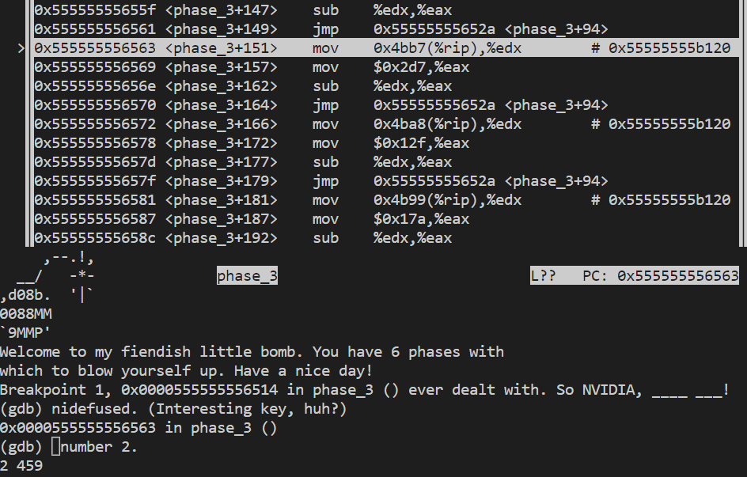

# Bomblab Report
##### 2021201709 李俊霖
## phase 1
+ 容易看出在调用字符串比较函数之前载入了一个参数值，如果不匹配则爆炸。可知这是一个字符串匹配的关卡，若不输入正确的字符串就会爆炸。
  
+ 输出载入地址处的字符串，为`NVIDIA has been the single worst company we've ever dealt with. So NVIDIA, ____ ___!`，即为通关密码。
+ ps.这是一句`Linus Torvalds`的名言。

## phase 2
+ 通过函数名和格式控制符都可以发现，要求输入六个数字。
  
+ 要求第一个数为4，第二个数为0x11，即17。
  
+ 关键代码分析，经过寄存器之间的来回赋值，此处要满足数列的通项关系为$4a_{n}+a_{n+1}=a_{n+2}$。
  
+ 根据前两项计算可得到该数列为`4 17 33 101 233 637`，为通关密码。

## phase 3
+ 通过查看scanf前载入的格式控制符可以发现，要求输入两个数字。
  
  
+ 第一个数字不能大于7。
  
+ 阅读代码逻辑发现第二个数字的比较是根据第一个数字来的，而且内部数字、逻辑比较复杂，直接输入两个数字`2 456`进入gdb调试。
  
+ 经过操作，可以得知最后eax的值要为356，即第一个数为2时，输入的第二个数应为356才正确。
  
+ 因此一个可行的通关密码为`2 356`。

## phase 4
+ 需要输入两个数字。
  
+ 进入func4函数之后判断两个值，可知第二个数操作之后必须为6，且函数返回值必须为6。第一个数输入必须小于15。
  
+ 经过gdb调试得知，第二个数为12时，经过操作之后必定为6，与第一个数无关。
+ 下一步分析func4函数，找到第一个数的输入。
+ func4代码逻辑如图，可知这是一个递归函数。
  
+ 使用gdb调试，发现输入第一个数6时，得到函数的返回值为6.
+ 因此通关密码为`6 12`满足条件。
## phase 5
+ 进入函数，输入字符串，且字符个数一定要为6个。
    
+ 可以发现不爆炸的条件为，循环6次，使最终的ecx为46。
    
+ 根据代码可知，ecx 是一个累计的量，每次累计的值为[4(c&0xf)+rsi]（[]的含义为取该地址内的值）。
+ 地址内的值可以打出来，如下：
    
    
+ a的ASCII值为0x61，与0xf取与操作得1；b得2，c得3，以此类推。因此相当于每一个小写字母在表中从+4一直往下取对应的数值，6个对应的数值相加为46即可。
+ 可满足的情况有多种，此处取一组`abcdec`，对应的数字分别为10 6 1 12 16 1，加起来等于46，满足条件。因此通关密码可以为`abcdec`。
## phase 6
+ 进入汇编代码phase_6函数，需要输入六个数字。
+ 第一个数字-1必须<=5，即第一个必须<=6。
  
+ 对一大段循环跳转进行分析，总结出判断合法性基本逻辑为：输入的6个数必须每个都不相同，且都在1-6区间内，即一个1-6数字的排列。
  
+ 接下来一段循环，含义为将x转成7-x。
  
+ 在2772中，代码把一个地址载入了rdx中，将这个地方的地址打出来，可以发现有以下结构。
   
   发现其类似于一个链表的结构，第一项为数据，第二项为下标顺序，第三项为next的地址，可以如node1的next为70512=0x11370，得到验证。由于只显示了node1-node5，按照这个思路把node5的next值打出来，可得到六个node，node6的next为0，即该链表有六个元素，也符合输入六个数的规则。
   
+ 下面对关键的linknode操作的代码进行分析。
    
    发现此处是按照输入顺序进行考察。要求(%rbx) − %eax ≥ 0 推出 ( %rbx) ≥ %eax即0x8(%rbx)，可知要按照node的数值进行降序排列，得到排列如下：`6 4 5 2 1 3`，因此7-x之前的值为`1 3 2 5 6 4`，即为通关密码。
+ 至此，前六关全部完成破解。

## secret phase
+ 首先寻找secret phase的入口，在汇编代码中发现secret phase函数，搜索发现在phase_defuse里会调用secret phase函数。

+ 在调用之前，发现phase_4的输入格式控制符除了两个数字之外，多了一个字符串%s，这个就是隐藏入口；根据字符串比对函数，把比对的值打出，可知该隐藏的命令字符串是Testify。

+ 对secret_phase函数分析。

  + 进入fun7函数前把一段地址传给了rdi。
  + 从fun7函数返回后，返回值若等于0x1e，则安全，否则爆炸。
+ 对fun7函数分析。

fun7函数的基本逻辑是：
    + 循环读入每一个字符，每一个只能是小写字母，否则爆炸。
    + 循环找到每一个字符和字母‘a’的差值x，x*8作为字节偏移量，把这个偏移量加上进入fun7函数前的地址（基地址），该地址处存储的值作为下一个字符的基地址，循环往复，相当于一个用偏移和内存里的值建立一连串链式链接的结构（整体上是一个类似于**字典树**的结构）。
    + 对于最后一个字母，它偏移之后的地址里存放的值应该为函数返回值，即0x1e。
+ 开始解构该链式结构。
  + 运行后使用gdb调试找到该段内存的初始地址`0x55555555cae0 <t0>:`
  + 使用类似于`(gdb) x/3000gx 0x55555555cae0`的指令将该位置前后的大量内存以8字节的形式打出来，如图。
  
  + 寻找目标值0000001e，然后一步步从后往前逆推，直到回到初始地址`<t0>`。得到以下回溯链条：
    
  + 每一个节点的相对于‘a’的偏移量分别为`20 1 18 2 1 12 12`，对应的字母分别为`t a r b a l l`，即该字符串为`tarball`，为该关卡的密码。
+ **`tarball`是linux系统下一种方便的打包工具**。
+ 所有炸弹已拆除，结果如图。
  
## 总结与体会
+ 经过本次$bomblab$的实践，我对汇编代码的阅读从一开始的带有一丝恐惧和抗拒心理到后来的比较熟练，可以熟练地应用$gdb$调试方法对自己阅读代码得到的逻辑假设和猜想做求证。大胆猜测，小心求证，是完成本次实验的八字箴言。
+ 对$6$个普通`phase`和`secret phase`的求解过程，我对链表、树等数据结构和循环、递归函数的汇编实现方式有了更为深入的理解。
+ 稍显遗憾的是，由于在$gdb$调试过程中刚开始的不熟练外加某两次单步调试$ni$误输入为$n$，导致拆弹过程中炸弹很不幸地炸了$3$次。
+ 炸得确实很绚烂！
  