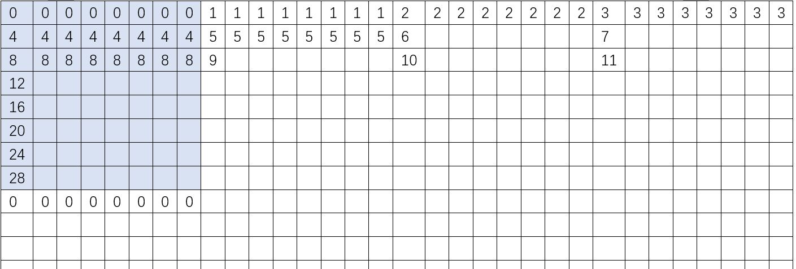
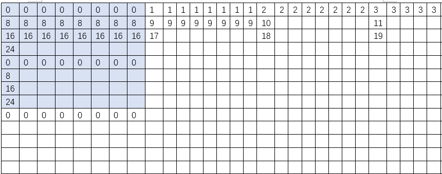
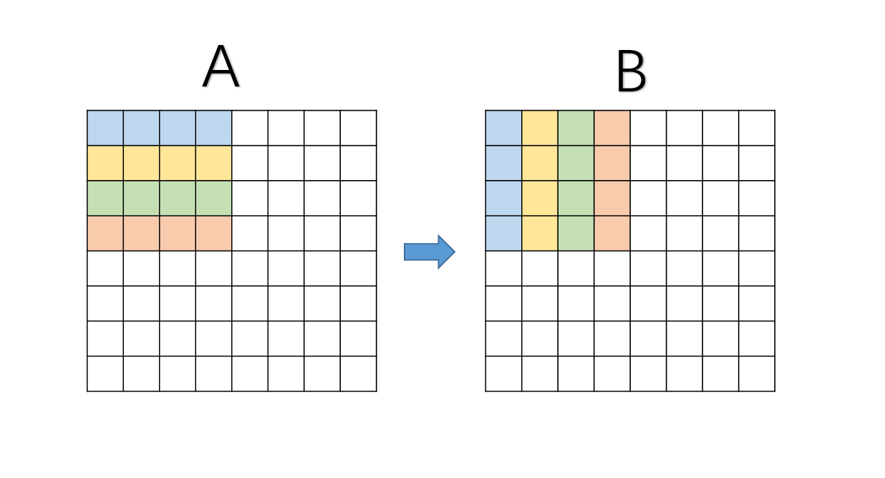
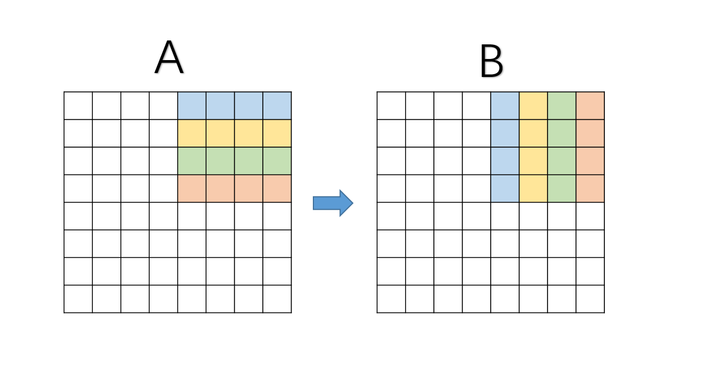
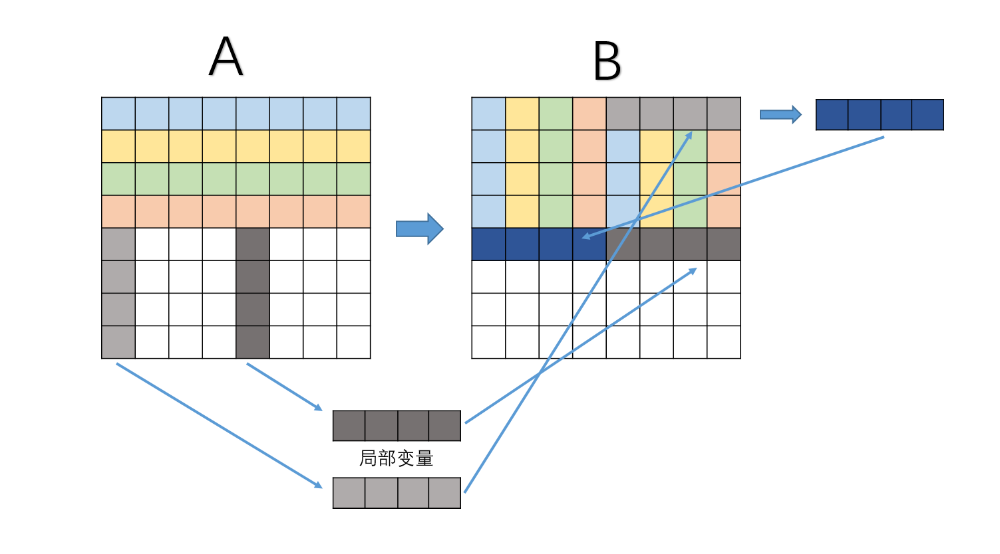
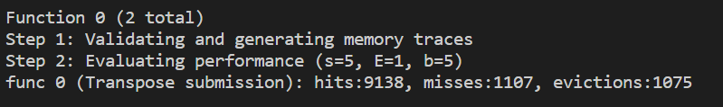

# CacheLab Report
##### 2021201709 李俊霖
## 1.part A
### 1.1.基本思路
+ 用一个结构体保持一个cacheline的信息，包括有效位、标记位、时间戳，时间戳用于LRU替换策略。
+ 在主函数中，处理并提取命令行中获取的相关参数。
+ 初始化cache后，读取traces文件，对每一行指令进行cache模拟。
+ 在cache模拟中，按照cache查询的基本思路。
  + 若在该组内有某一cacheline命中，则记录一次hit，结束。
  + 否则查找空的cacheline，填入，记录一次miss，结束。
  + 若无空的cacheline，则按照时间戳找到更新时间最长的，替换，记录一次miss和evict，结束。
  + 每次cache模拟结束后对每一个有效的cacheline的时间戳+1。
+ 模拟完成后释放cache空间。
### 1.2.实现细节
+ cacheline结构体
 ```c
  typedef struct Cache
  {
      int valid;        //有效位
      int tag;          //标记位
      int time_stamp;   //时间戳,LRU算法
  }CacheLine;
  ```
+ cache模拟
```c
void solve_Cache(uint64_t addr, int b, int s, int E)//[address:tag/index/offset (t/s/b)]
{
    int mask = ((unsigned)(-1)) >> (64 - s);
    int index = (addr >> b) & mask;
    int tag = addr >> (b + s);

    //对于index组里的每一行，查看是否已存在缓存，若有，则hit++，且不再执行以下步骤
    if(find_hit(E, index, tag)) return;

    //查找组内空行，若有，则miss++，且不再执行以下步骤
    if(find_emptyline(E, index, tag)) return;

    //没有缓存，组内没有又空行 -> LRU替换  
    LRU(E, index, tag);
    Evicts++;
    Misses++;
    return;
}

```
+ 时间戳更新
```c
//对于有效的cache，每次访问时间戳都加1
void update_Time_stamp(int S, int E)
{
    for(int i = 0; i < S; i++)
    {
        for(int j = 0; j < E; j++)
        {
            if(Cache[i][j].valid == 1)
                Cache[i][j].time_stamp++;
        }
    }
}
```
## 2.part B
+ 该高速缓存的架构是$s = 5, E = 1, b = 5$。即32组，每组1行，每个缓存块32byte（可存入8个整型变量）。
### 32×32矩阵
+ 32×32矩阵中每一个位置对应cache中的set大致如图。
  
+ 可以发现，若对其按8×8分块，则块内的数据每一行都不在同一个set内，不会产生冲突。
+ 考虑8×8分块分块直接`B[j][i] = A[i][j]`赋值，会发现在对角线时，每一次加载`A[i][i]`接着保存`B[i][i]`，此时会带来比较多的eviction（两个矩阵冲突）。
+ 考虑到我们还可以使用12个以内的局部变量，则第一次行的八个数先存入局部变量，然后再赋给列的八个数。
+ 理想情况下，每一行的读取只会在第一次cold miss，命中率约为7/8；对于每一列的读取，只会在第一列cold miss，此后都命中，命中率约为7/8。
+ 代码：
```c
void trans_32_32(int M, int N, int A[N][M], int B[M][N])
{
    for (int i = 0; i < 32; i += 8)
    {      
        for (int j = 0; j < 32; j += 8)
        {  
            for (int k = 0; k < 8; k++) {  
                int t1 = A[i][j];                  
                int t2 = A[i][j + 1];
                int t3 = A[i][j + 2];
                int t4 = A[i][j + 3];
                int t5 = A[i][j + 4];
                int t6 = A[i][j + 5];
                int t7 = A[i][j + 6];
                int t8 = A[i][j + 7];
                B[j][i] = t1;  
                B[j + 1][i] = t2;
                B[j + 2][i] = t3;
                B[j + 3][i] = t4;
                B[j + 4][i] = t5;
                B[j + 5][i] = t6;
                B[j + 6][i] = t7;
                B[j + 7][i] = t8;
                i++;
            }
            i -= 8;
        }
    }
}
```
### 61×67矩阵
+ 由于61×67的矩阵比较不规整，对角线的冲突消失，因此只需要考虑分块之后转置即可。
+ 分块的大小通过尝试得出，$18×5$的分块的大小，结果为`misses=1861`，满足`misses < 2000`的要求。
+ (在笔者尝试的多组数据中，最优方案是$17×4$的分块，达到1848次misses。)
+ 代码：
```c
void trans_61_67(int M, int N, int A[N][M], int B[M][N])
{
    int block_x = 18; 
    int block_y = 5;
    for (int i = 0; i < N; i += block_x)
    {
        for (int j = 0; j < M; j += block_y)
        {
            for (int k = i; k < N && k < i + block_x; k++)
            {
                for (int l = j; l < M && l < j + block_y; l++) 
                    B[l][k] = A[k][l];
            }
                
        }
    }
}
```
### 64×64矩阵
#### 朴素思想
+ 32×32矩阵中每一个位置对应cache中的set大致如图。
  
+ 可以发现，该矩阵每4行就会产生重复，若对其按8×8分块，行操作尚可，在列操作时依旧会产生相当多的冲突。
+ 考虑直接4×4分块，在4×4块内确实可以实现最少的冲突，但是没有充分利用cache的容量，效果依旧没有达到要求。（1699次$miss$，未达到要求1300次以下）

#### 进阶思想
+ 为了充分利用缓存在cache中的数据，依旧考虑8×8分块，并尝试在块内继续分块。
+ 基本思路：
  + step1：
    + 为了充分利用前4行的8个数字，先对前四行分成左上/右上两块（4×4块），分别转置，转置过程中用8个局部变量来减少AB相互冲突。完成后左上块归位，右上块需平移到左下归位。
    + 
    + 
  + step2：
    + 提取A数组中5-8行中的第1、5列，放入局部变量；
    + 交换局部变量和第1行中的后四个数（5-8行中的第1列数归位）
    + 第1行中的5678个数归位。
    + 第5列放入正确位置：第5行的后四个数。
    + 
  + 该思路可以很好地减少$AB$矩阵内部的缓存冲突：8×8块中上下4行分开操作，缓存不冲突。但无法解决对角线块中的AB共用缓存冲突。
+ 缓存命中分析：
  + step1：
    + 前4行分别再不同的缓存行，不会冲突先从A中提取再存入B中，每8个只有一个$miss$，一共8次$miss$；（对角线块多3次，一共11次m$iss$）
  + step2:
    + 从A中读取存入局部变量，一共4次$miss$；
    + 交换第k列和第1行中的第后四个数，B在缓存中，0次$miss$；
    + 第5行整体归位，每次都是和B的前4行某一行冲突，一共$1×4$次$miss$；
    + （对角线块会产生AB矩阵的冲突，会有15次$miss$，比非对角线块多7次）
  + 因此$miss$次数一共为：非对角线块$（56×16）$+对角线块$（8×（15+11））$=1104次$miss$。（系统有3次无法避免的$miss$）
  + 


  
+ 代码：
```c
void trans_64_64(int M, int N, int A[N][M], int B[M][N])
{
    for (int i = 0; i < M; i += 8)
    {      
        for (int j = 0; j < N; j += 8)
        {  
            for (int k = 0; k < 4; k++)//前四行，分成左上/右上两块，分别转置
            {
                int t1 = A[i + k][j];       // A 从上到下 行（左上块）
                int t2 = A[i + k][j + 1];
                int t3 = A[i + k][j + 2];
                int t4 = A[i + k][j + 3];
                int t5 = A[i + k][j + 4];   // A 从上到下 行（右上块）
                int t6 = A[i + k][j + 5];
                int t7 = A[i + k][j + 6];
                int t8 = A[i + k][j + 7];           
                B[j][i + k] = t1;           // B 从左到右 列（左上块）
                B[j + 1][i + k] = t2;
                B[j + 2][i + k] = t3;
                B[j + 3][i + k] = t4;
                B[j][i + k + 4] = t5;       // B 从左到右 列（右上块）
                B[j + 1][i + k + 4] = t6;
                B[j + 2][i + k + 4] = t7;
                B[j + 3][i + k + 4] = t8;
            }
            for (int k = 0; k < 4; k++)
            {
                // 提取A数组中5-8行中的第k、k+4列
                int t1 = A[i + 4][j + k];
                int t2 = A[i + 5][j + k];
                int t3 = A[i + 6][j + k];
                int t4 = A[i + 7][j + k];
                int t5 = A[i + 4][j + k + 4];
                int t6 = A[i + 5][j + k + 4];
                int t7 = A[i + 6][j + k + 4];
                int t8 = A[i + 7][j + k + 4];
                //交换局部变量和第1行中的后四个数
                swap(&B[j + k][i + 4], &t1);
                swap(&B[j + k][i + 5], &t2);
                swap(&B[j + k][i + 6], &t3);
                swap(&B[j + k][i + 7], &t4);
                //第1行中的5678个数放入正确位置
                B[j + k + 4][i] = t1; 
                B[j + k + 4][i + 1] = t2; 
                B[j + k + 4][i + 2] = t3; 
                B[j + k + 4][i + 3] = t4; 
                //第k+4列放入正确位置：第5行的后四个数
                B[j + k + 4][i + 4] = t5;
                B[j + k + 4][i + 5] = t6;
                B[j + k + 4][i + 6] = t7;
                B[j + k + 4][i + 7] = t8;
            }  
        }
    }
}
```
## 3.收获
通过本次实验，我对缓存的结构有了更深入的了解，更重要的是学会了定量的计算缓存的miss数量，受益匪浅。