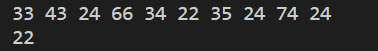

# Homework5 Report
## 基本实现
### c语言输入输出部分
```c
#include <stdio.h>
int get_min(int *num);

int main()
{
    int a[10];
    for (int i = 0; i < 10; i++)
        scanf("%d", &a[i]);
    printf("%d\n", get_min(a));
}
```
### 汇编实现get_min函数
基本思路：使用跳转指令`jmp`和`jge`、`jle`等改变代码逻辑，实现循环。
```
.text

.global get_min
.global start_loop
.global loop_exit

get_min:
pushq %r8 
pushq %r9 
pushq %r10 
movq $0, %r10
movl (%rdi,%r10,4), %r8d
movl %r8d, %r9d
jmp start_loop
movl $0, %eax

start_loop:
cmpq $9, %r10
jge exit_loop
incq %r10
movl (%rdi,%r10,4), %r9d
cmpl %r9d, %r8d
jle start_loop
movl %r9d, %r8d
jmp start_loop

exit_loop:
movl %r8d, %eax
popq %r10
popq %r9
popq %r8
ret
```
## 输入输出示例
+ 使用命令`gcc -o main main.c get_min.s -std=c99`编译成可执行文件`main`，随后使用命令`./main`运行该程序。
+ 命令行输入十个数，结果如图。
+ 

## 反汇编与结果比对
### 反汇编
+ 使用反汇编指令`gcc -Og -S main1.c`，得到汇编代码如下。
```
	.file	"main1.c"
	.text
	.globl	get_min
	.type	get_min, @function
get_min:
.LFB11:
	.cfi_startproc
	movl	(%rdi), %eax
	movl	$1, %edx
	jmp	.L2
.L4:
	movslq	%edx, %rcx
	movl	(%rdi,%rcx,4), %ecx
	cmpl	%eax, %ecx
	jge	.L3
	movl	%ecx, %eax
.L3:
	addl	$1, %edx
.L2:
	cmpl	$9, %edx
	jle	.L4
	rep ret
	.cfi_endproc
.LFE11:
	.size	get_min, .-get_min
	.section	.rodata.str1.1,"aMS",@progbits,1
.LC0:
	.string	"%d"
.LC1:
	.string	"%d\n"
	.text
	.globl	main
	.type	main, @function
main:
.LFB12:
	.cfi_startproc
	pushq	%rbx
	.cfi_def_cfa_offset 16
	.cfi_offset 3, -16
	subq	$48, %rsp
	.cfi_def_cfa_offset 64
	movl	$0, %ebx
	jmp	.L7
.L8:
	movslq	%ebx, %rax
	leaq	(%rsp,%rax,4), %rsi
	movl	$.LC0, %edi
	movl	$0, %eax
	call	__isoc99_scanf
	addl	$1, %ebx
.L7:
	cmpl	$9, %ebx
	jle	.L8
	movq	%rsp, %rdi
	call	get_min
	movl	%eax, %esi
	movl	$.LC1, %edi
	movl	$0, %eax
	call	printf
	addq	$48, %rsp
	.cfi_def_cfa_offset 16
	popq	%rbx
	.cfi_def_cfa_offset 8
	ret
	.cfi_endproc
.LFE12:
	.size	main, .-main
	.ident	"GCC: (GNU) 4.8.5 20150623 (Red Hat 4.8.5-44)"
	.section	.note.GNU-stack,"",@progbits

```
### 代码比对分析
通过查看和比对get_min函数部分的汇编代码，可以发现主要区别有：
+ 机器生成的汇编代码使用了更少的寄存器，对寄存器的使用更高效。
+ 机器生成的汇编代码有更多的跳转指令和模块，如每一个if语句和循环语句都设置了跳转指令，代码的逻辑更清晰且代码量更少。