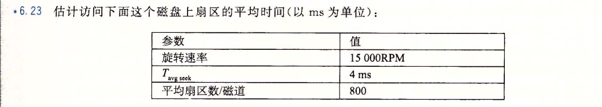
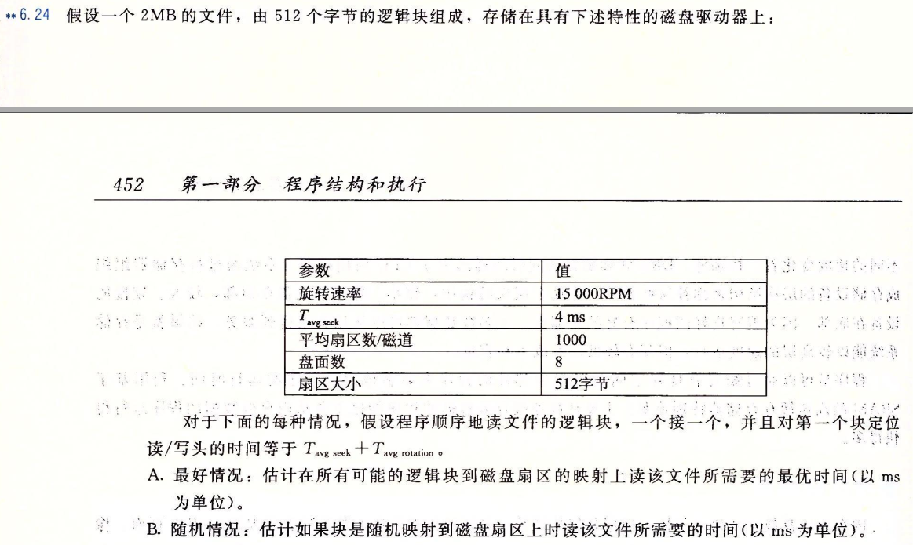

# 磁盘性能计算
##### 2022.11.27
## 6.23

访问时间估算:
+ 平均旋转延迟: $T_{avg Rotation}=\frac {1}{2}\times\frac {1}{15000}\times\frac {60s}{1min}\times\frac {1000ms}{1s}=2ms$
+ 平均传送时间:$T_{avg Transfer}=\frac {1}{15000}\times\frac {1}{800}\times\frac {60s}{1min}\times\frac {1000ms}{1s}=0.005ms$
+ 总访问时间：$T=T_{avg Seek}+T_{avg Rotation}+T_{avg Transfer}=6.005ms$ 

## 6.24

+ 这个文件由约4000个512字节的逻辑块组成。对于磁盘来说：
  + $T_{avg Seek}=4ms$
  + $T_{max Rotation}=\frac {1}{15000}\times\frac {60s}{1min}\times\frac {1000ms}{1s}=4ms$
  + 平均旋转延迟: $T_{avg Rotation}=\frac {1}{2}\times\frac {1}{15000}\times\frac {60s}{1min}\times\frac {1000ms}{1s}=2ms$
  + 平均传送时间:$T_{avg Transfer}=\frac {1}{15000}\times\frac {1}{800}\times\frac {60s}{1min}\times\frac {1000ms}{1s}=0.005ms$
+ 最好情况：不需要额外移动读写头，需要磁盘转4圈（每圈1000个扇区），因此读写总时间为：
  + $T=T_{avg Seek}+T_{avg Rotation}+4\times T_{max Rotation}=22ms$ 
+ 随机情况：读4000块中，每一块都需要$T_{avg Seek}+T_{avg Rotation}ms$，因此读文件总时间为：
  + $T=4000\times (T_{avg Seek}+T_{avg Rotation})=24000ms=24s$ 
